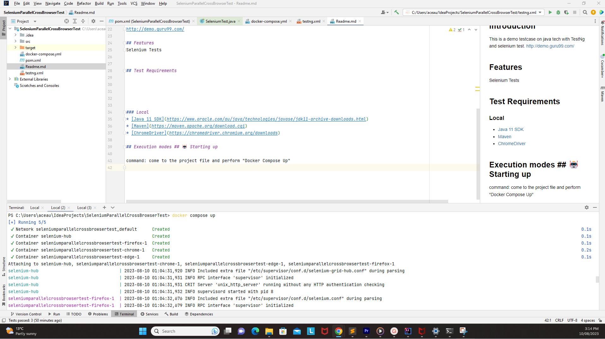

<h1 align="center"> Selenium Code - Java - CrossBrowser Testing - single test of sample application in 3 different browsers in docker  </h1>  

  Description: This is a demo testcase on java tech with TestNg framework.
There is a single test which opens the website: http://demo.guru99.com/ and verifies the Title of the website and 
the same test is being performed in 3 different browsers: Google chrome, Microsoft Edge, Mozilla Firefox

## Table of Contents

- [Introduction](#introduction)
- [Features](#features)
- [Requirements](#requirements)
- [Quick Start](#quick-start)

## Introduction
This is a demo testcase on java tech with TestNg and selenium test.
http://demo.guru99.com/

## Features
Selenium Tests

## Test Requirements

### Local
* [Java 11 SDK](https://www.oracle.com/au/java/technologies/javase/jdk11-archive-downloads.html)
* [Maven](https://maven.apache.org/download.cgi)
* [ChromeDriver](https://chromedriver.chromium.org/downloads)

## Execution modes ## 🤖 Starting up

command: come to the project file and perform "Docker Compose Up"

once the docker hub and nodes are up and running then perform the tests by right-clicking on the TestNG and running the tests.
